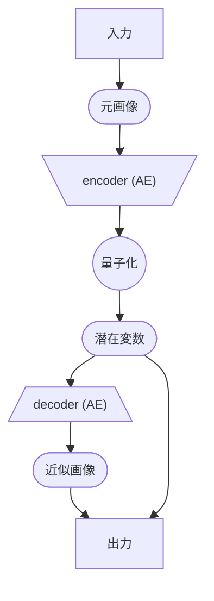
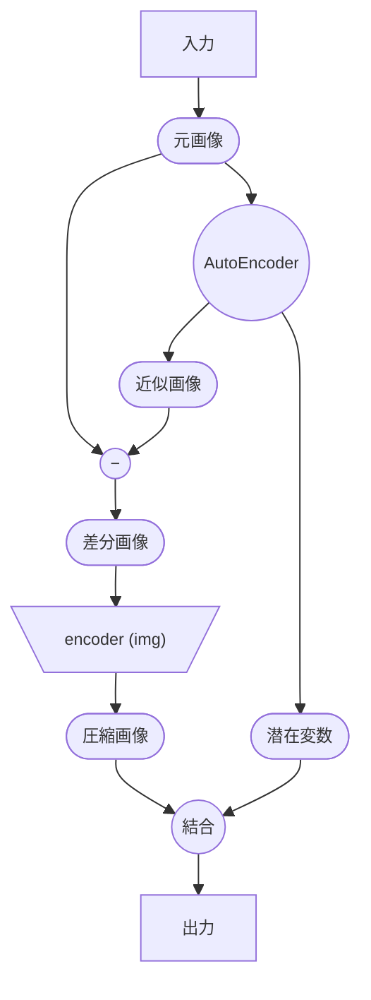
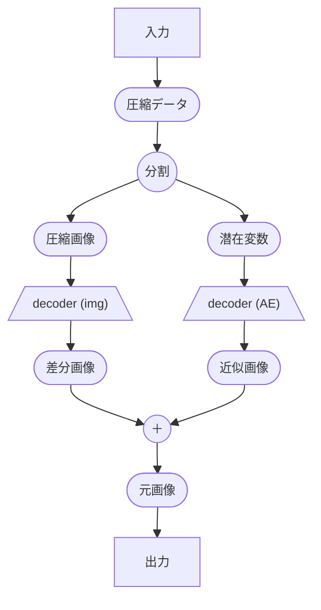

```mermaid
%%{init: {
    'flowchart': {'rankSpacing': 30},
    'themeVariables': {'fontSize': '12px'}
}}%%
graph TD

入力 --> org([元画像])
 --> enc[\"encoder (AE)"/]
 --> qu((量子化))
 --> lat([潜在変数]) 
 --> dec[/"decoder (AE)"\]
 --> approx([近似画像])
approx --> 出力
lat --> 出力
```

```mermaid
%%{init: {
    'flowchart': {'rankSpacing': 30},
    'themeVariables': {'fontSize': '12px'}
}}%%
graph TD
    入力 --> org([元画像])
    org --> AE((AutoEncoder))
    AE --> lat([潜在変数])
    AE --> approx([近似画像])

    org --> sub(("−"))
    approx --> sub
    sub --> diff([差分画像])
    diff --> encoder2[\"encoder (img)"/]
    encoder2 --> bin([圧縮画像])

    bin --> concat((結合))
    lat --> concat


    concat --> 出力
```

```mermaid
%%{init: {
    'flowchart': {'rankSpacing': 30},
    'themeVariables': {'fontSize': '12px'}
}}%%
graph TD
    入力 --> in([圧縮データ])
    in --> div((分割))
    div --> bin([圧縮画像])
    div --> lat([潜在変数])

    bin --> decoder2[/"decoder (img)"\]
    decoder2 --> diff([差分画像])

    lat --> decoder[/"decoder (AE)"\]
    decoder --> approx([近似画像])

    diff --> add(("＋"))
    approx --> add
    add --> org([元画像])
    org --> 出力
```

